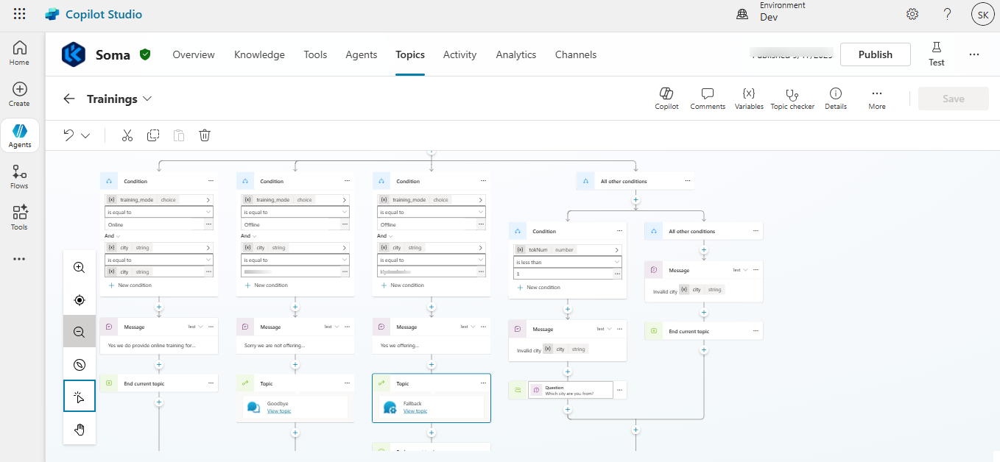
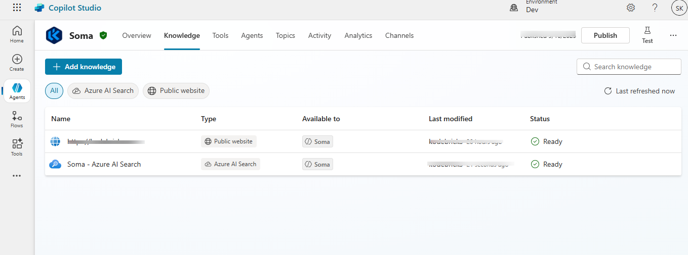
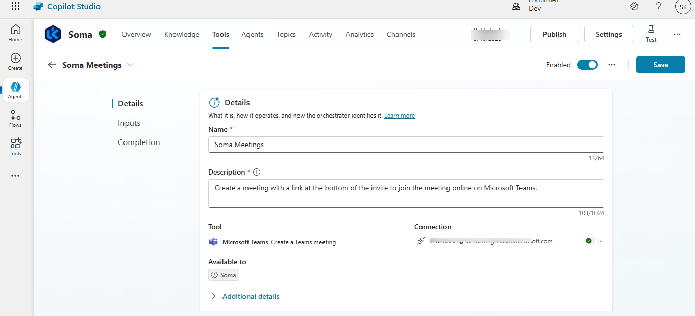
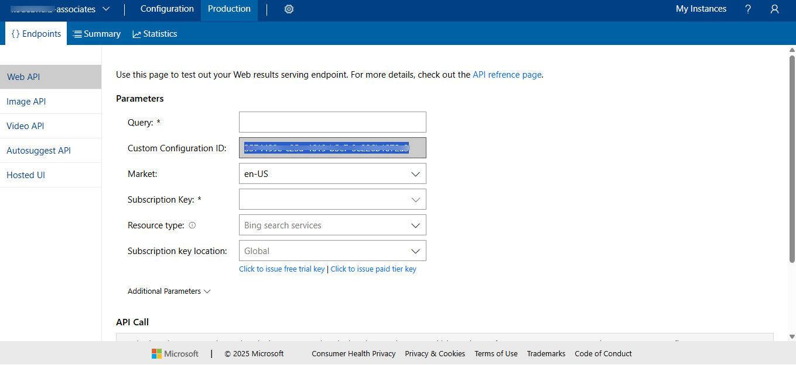
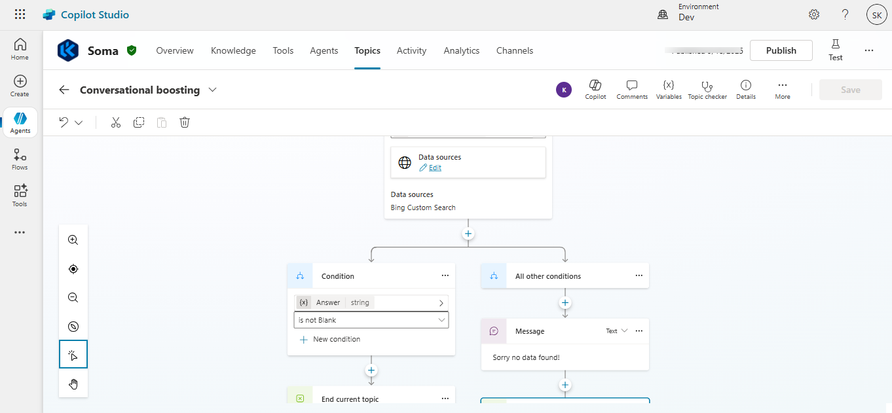
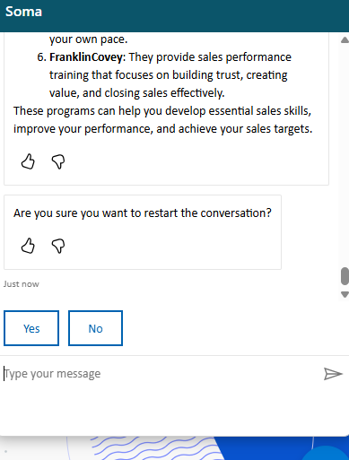
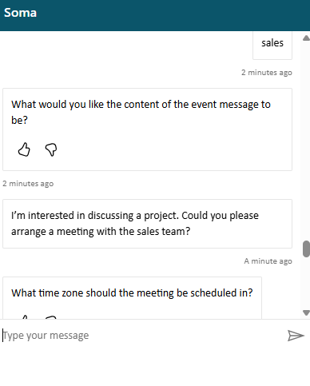

# Soma-Assistant

**Soma-Assistant** is a customer support copilot built on **Azure
Copilot Studio**.

Soma-Assistant ensures every interaction is professional, supportive, and efficient, reflecting the company’s brand values. Its goal is not only to provide answers but also to create a seamless bridge between customers and business teams, resulting in improved customer satisfaction and faster sales engagement.

#### Author : SAIDA.D

## 🎯 Agenda

The main goal of Soma-Assistant is to provide **seamless customer
support** by combining AI-powered responses with integrated tools.

#### One of the Topic (Flow)

#### Knowledge base

#### Tools

#### Bing Custom Search (Soma)

#### Conversational boosting

### Copilot-Soma in action

|  |  |
|---|---|

## 🚀 Features

1.  **Customer Support Q&A**
    -   Answers questions using the connected **knowledge base**,
        **website**, and **Azure AI Search**.
2.  **Product & Service Guidance**
    -   Provides accurate and concise information about company
        **products, services, and policies**.
3.  **Sales Engagement**
    -   Offers to schedule a **Microsoft Teams meeting** with the sales
        team whenever customers request **project deals, quotations, or
        direct engagement**.
4.  **Bing Custom Search**
    -   Provided Bing custom search to hold outcome within boundry

5.  **Content Moderation**
    -   To ensure safety and accuracy, the agent responds only when the content meets a high confidence threshold.
	

## 📌 Guidelines for Soma-Assistant

-   Always be **polite, professional, and supportive**.\
-   Summarize information from knowledge base or AI Search clearly
    before responding.\
-   If customer asks about **project deals, quotations, or direct
    contact**, suggest scheduling a **Teams meeting** and use the Teams
    Meeting tool.\
-   If the answer is not known, acknowledge and offer to connect with
    the right resource.

## 🎯 Objective

To make **customer interactions smooth, efficient, and helpful** while
representing the company's brand positively.

------------------------------------------------------------------------

✨ Built with **Azure Copilot Studio**, **Topics**,**Entities**, **Azure AI Search**, and
**Microsoft Teams** integration.
